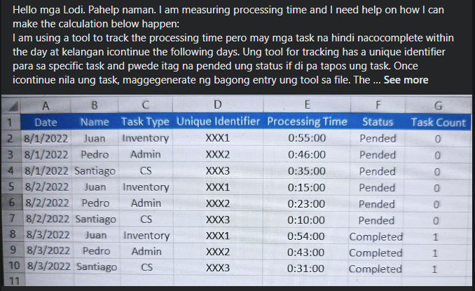

[source](https://www.facebook.com/groups/694920197382936/permalink/1905376169670660)

# Problem

Hello mga Lodi. Pahelp naman. I am measuring processing time and I need help on how I can make the calculation below happen:
I am using a tool to track the processing time pero may mga task na hindi nacocomplete within the day at kelangan icontinue the following days. Ung tool for tracking has a unique identifier para sa specific task and pwede itag na pended ung status if di pa tapos ung task. Once icontinue nila ung task, maggegenerate ng bagong entry ung tool sa file. The question is: paano ko macocombine ung lahat ng processing time sa task na paputol putol using the unique identifier and will only be counted as one entry kapag natag na ung status is completed?

_Translated, simplified and additional info_

1. Based on the ___Unique Identifier___, combine and add ___Processing Time___ into one row when the ___Unique Identifier___ is ___Completed___. The ___Date___ that should be displayed in the combined row is the ___Completed___ date. ___Task Count___ should be _1_ in the combined row.

2. Once a task is ___Completed___, it can be ___Pended___ again. Once this happens, the combined ___Completed___ row should be left as it is. The new ___Pended___ task should be combined when it is ___Completed___. In other words, apply #1 to new ___Pended___ tasks.

This means that, if a task was ___Completed___, ___Pended___ and ___Completed___ again, there should be 2 ___Completed___ rows with ___Task Count___ of 1 each.