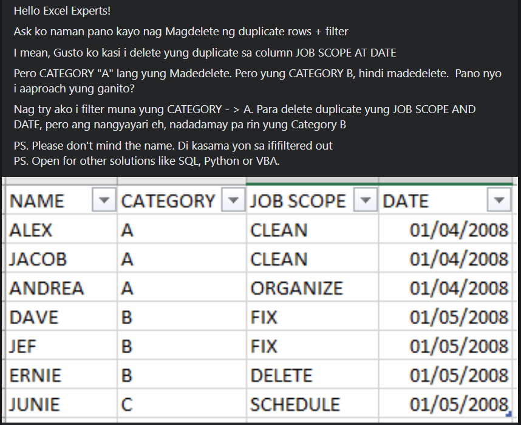

[source](https://www.facebook.com/groups/694920197382936/permalink/1908284009379876)

# Problem

Hello Excel Experts!
Ask ko naman pano kayo nag Magdelete ng duplicate rows + filter
I mean, Gusto ko kasi i delete yung duplicate sa column JOB SCOPE AT DATE 
Pero CATEGORY "A" lang yung Madedelete. Pero yung CATEGORY B, hindi madedelete.  Pano nyo i aaproach yung ganito?
Nag try ako i filter muna yung CATEGORY - > A. Para delete duplicate yung JOB SCOPE AND DATE, pero ang nangyayari eh, nadadamay pa rin yung Category B

PS. Please don't mind the name. Di kasama yon sa ififiltered out

PS. Open for other solutions like SQL, Python or VBA.

_Translated and simplified_

Delete duplicate rows but delete only specific categories.